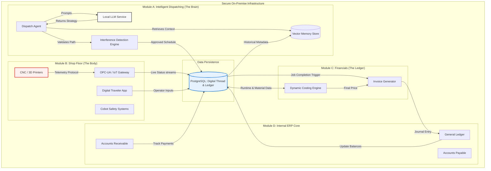

# Englabs On-Premise MES Architecture Design

## 1. System Architecture Diagram
This diagram illustrates the "Digital Thread" and secure on-premise data flow.



## 2. Database Schema (SQL)
Designed for PostgreSQL with JSONB support for flexibility in the Digital Thread.

```sql
-- Englabs Digital Thread Database Schema

-- 1. MACHINES (The Hardware Agents)
CREATE TABLE machines (
    machine_id UUID PRIMARY KEY DEFAULT gen_random_uuid(),
    name VARCHAR(255) NOT NULL,
    capabilities JSONB NOT NULL, -- e.g., {"axis": 5, "max_dims": [500, 500, 500], "materials": ["PLA", "Ti-6Al-4V"]}
    current_status VARCHAR(50) DEFAULT 'IDLE', -- IDLE, RUNNING, MAINTENANCE, ERROR
    telemetry_topic VARCHAR(255), -- MQTT/OPC-UA topic mapping
    location_coords JSONB, -- {"x": 10, "y": 20} for map view
    created_at TIMESTAMP WITH TIME ZONE DEFAULT NOW()
);

-- 2. ORDERS (The Demand Signal)
CREATE TABLE orders (
    order_id UUID PRIMARY KEY DEFAULT gen_random_uuid(),
    customer_id VARCHAR(255) NOT NULL,
    priority_level INTEGER DEFAULT 1, -- 1-10
    cad_file_path VARCHAR(1024) NOT NULL, -- Path to stored STL/STEP file
    technical_requirements JSONB NOT NULL, -- {"material": "Inconel", "tolerance": "0.01mm"}
    status VARCHAR(50) DEFAULT 'PENDING', -- PENDING, PLANNED, IN_PROGRESS, QC, COMPLETE, SHIPPED
    received_at TIMESTAMP WITH TIME ZONE DEFAULT NOW(),
    estimated_delivery TIMESTAMP WITH TIME ZONE
);

-- 3. DISPATCH_QUEUE (The Schedule / Digital Thread Link)
CREATE TABLE dispatch_queue (
    job_id UUID PRIMARY KEY DEFAULT gen_random_uuid(),
    order_id UUID REFERENCES orders(order_id),
    machine_id UUID REFERENCES machines(machine_id),
    
    -- Planning Data
    planned_start_time TIMESTAMP WITH TIME ZONE,
    estimated_runtime_seconds INTEGER,
    gcode_path VARCHAR(1024), -- Path to generated instruction set
    nesting_coordinates JSONB, -- {"x_offset": 100, "y_offset": 50, "rotation": 90}
    
    -- Execution Data
    actual_start_time TIMESTAMP WITH TIME ZONE,
    actual_end_time TIMESTAMP WITH TIME ZONE,
    
    -- Status
    status VARCHAR(50) DEFAULT 'QUEUED', -- QUEUED, MACHINING, FINISHING, PAUSED, COMPLETED
    
    -- Quality / Memory Feedback
    interference_detected BOOLEAN DEFAULT FALSE,
    successful_run BOOLEAN DEFAULT TRUE, -- Used for AI Memory reinforcement
    created_at TIMESTAMP WITH TIME ZONE DEFAULT NOW()
);

-- 4. INVOICES (The Financial Record)
CREATE TABLE invoices (
    invoice_id UUID PRIMARY KEY DEFAULT gen_random_uuid(),
    job_id UUID REFERENCES dispatch_queue(job_id),
    order_id UUID REFERENCES orders(order_id),
    
    -- Costing Components
    machine_runtime_cost DECIMAL(10, 2) NOT NULL,
    material_cost DECIMAL(10, 2) NOT NULL,
    labor_cost DECIMAL(10, 2) DEFAULT 0.00,
    surcharges DECIMAL(10, 2) DEFAULT 0.00,
    
    total_amount DECIMAL(10, 2) NOT NULL,
    currency VARCHAR(3) DEFAULT 'USD',
    
    generated_at TIMESTAMP WITH TIME ZONE DEFAULT NOW(),
    synced_to_erp BOOLEAN DEFAULT FALSE,
    erp_reference_id VARCHAR(255) -- ID returned from QuickBooks/Xero
);

-- Indexes for performance
CREATE INDEX idx_dispatch_status ON dispatch_queue(status);
CREATE INDEX idx_orders_customer ON orders(customer_id);
```

## 3. Memory-Augmented Dispatching Logic (Pseudocode)
This logic implements Module A's core intelligence, specifically the "Anti-Hallucination" strategy.

```python
class DispatchAgent:
    def __init__(self):
        self.llm = LocalLLMClient(model="llama-3-70b-instruct")
        self.memory_db = VectorStoreClient("dispatch_history")
        self.interference_engine = GeometricKernel()

    def dispatch_order(self, new_order):
        """
        Main entry point for "Memory-Augmented" dispatching.
        """
        # 1. Feature Extraction
        # Convert mechanical reqs into a vectorizable string format
        order_features = self.extract_features(new_order.cad_file, new_order.specs)
        
        # 2. Memory Retrieval (The "Anti-Hallucination" Step)
        # Find past jobs with similar geometries and materials that succeeded
        successful_precedents = self.memory_db.query(
            vector=order_features, 
            filter={"success": True}, 
            top_k=3
        )
        
        # 3. Prompt Construction
        # Inject precedents into the context to ground the LLM
        system_prompt = self.build_prompt(
            role="Senior Manufacturing Engineer",
            context=f"Here are successful past strategies for similar parts: {successful_precedents}",
            task="Assign best machine and orientation."
        )
        
        # 4. AI Strategy Generation
        candidate_plan = self.llm.generate(system_prompt, new_order)
        
        # 5. Deterministic Validation (Interference Check)
        # Never trust the LLM fully for geometry; verify with math.
        is_safe, collision_data = self.interference_engine.simulate_nesting(
            machine=candidate_plan.machine,
            part_geometry=new_order.cad_file,
            orientation=candidate_plan.orientation
        )
        
        if is_safe:
            # 6. Commit to Digital Thread
            job_id = self.create_dispatch_entry(new_order, candidate_plan)
            # Store this decision logic in short-term memory
            self.memory_db.add(features=order_features, plan=candidate_plan, status="Tentative")
            return job_id
        else:
            # Recursion with negative feedback
            return self.handle_conflict(new_order, candidate_plan, collision_data)

    def handle_conflict(self, order, failed_plan, collision_data):
        """Re-prompts LLM with specific collision error data."""
        feedback_prompt = f"Previous plan failed due to collision at {collision_data}. Suggest alternative orientation."
        # ... logic to retry or alert human operator on Visual Dispatch Board ...
```

## 4. Englabs Design System Config (Tailwind CSS)
Configuration for the "Minimalist White" aesthetic.

```javascript
/** @type {import('tailwindcss').Config} */
module.exports = {
  content: ["./src/**/*.{js,jsx,ts,tsx}"],
  theme: {
    extend: {
      colors: {
        // Englabs Brand Palette
        englabs: {
          blue: '#0056D2', // Primary Action (Deep Industrial Blue)
          green: '#008A45', // Success / Complete
          red: '#D92D20',   // Error / Stop
          grey: {
            900: '#1A1A1A', // Primary Text (High Contrast)
            700: '#4A4A4A', // Secondary Text
            500: '#9AA0A6', // Disabled / Hints
            100: '#F5F7FA', // Secondary Backgrounds (Sidebar/Cards)
            50: '#F8F9FA',  // Subtle hovers
          },
          white: '#FFFFFF', // Primary Background (Canvas)
        }
      },
      fontFamily: {
        sans: ['Inter', 'Roboto', 'sans-serif'], // High-legibility industrial standard
      },
      boxShadow: {
        // Minimalist elevation for cards (floating look)
        'englabs-card': '0 1px 3px 0 rgba(0, 0, 0, 0.1), 0 1px 2px 0 rgba(0, 0, 0, 0.06)',
        'englabs-floating': '0 4px 6px -1px rgba(0, 0, 0, 0.1), 0 2px 4px -1px rgba(0, 0, 0, 0.06)',
      },
      spacing: {
        '128': '32rem', // for wide Gantt charts
        '144': '36rem',
      }
    },
  },
  plugins: [],
}
```
