# Bright Kids: Product Vision & Flowchart

## The Vision
**"A safe, adaptive, and magical learning playground for early childhood education."**

Our goal is to build a high-fidelity alternative to *Khan Academy Kids*, focusing on three core pillars:
1.  **The "Sunny Valley" Adventure Map**: An adaptive, linear learning path where children progress node-by-node. The difficulty adjusts based on their performance, guided by the **Mascot**.
2.  **Universal Media Library**: A rich repository of interactive games, read-along books, and educational videos, accessible for free-form exploration.
3.  **Parental "Peace of Mind"**: A robust dashboard for offline content management (for car rides), progress tracking, and absolute safety (zero ads/tracking).

---

## App Flowchart

```mermaid
graph TD
    %% Global Entry
    LaunchNode(("App Launch")) --> SplashNode["Splash Screen"]
    SplashNode --> AuthNode{"Profile Selection"}

    %% Main Branches
    AuthNode -->|Kid Profile| MapNode["🌍 World Map<br/>(Sunny Valley)"]
    AuthNode -->|Parent Pin| DashNode["🛡️ Parent Dashboard"]

    %% Kid Loop - The Core Adventure
    subgraph KidLoop ["Kid Experience (Immersive)"]
        MapNode -->|Tap Node| ActivityNode{"Check Activity Type"}
        MapNode -->|Tap Library| LibNode["📚 Library Grid"]
        MapNode -->|Tap Mascot| GuideNode["🦁 Mascot Compantion<br/>(Hints/Cheer)"]

        ActivityNode -->|Video| VidPlayer["▶️ Video Player"]
        ActivityNode -->|Interactive| WebPlayer["🎮 HTML5 Game Engine"]
        ActivityNode -->|Book| BookPlayer["📖 Read-Along Engine"]

        %% Library Entry points
        LibNode -->|Filter: Math| LibGridNode["Content List"]
        LibGridNode --> ActivityNode

        %% Reward Loop
        VidPlayer --> SuccessNode["🎉 Celebration & Rewards"]
        WebPlayer --> SuccessNode
        BookPlayer --> SuccessNode
        
        SuccessNode -->|Next Node Unlocked| MapNode
    end

    %% Parent Loop - Control & Insight
    subgraph ParentLoop ["Parent Zone (Protected)"]
        DashNode --> ProgressNode["📊 Progress Reports"]
        DashNode --> OfflineNode["⬇️ Offline Manager<br/>(Download Packs)"]
        DashNode --> SettingsNode["⚙️ App Settings"]
        
        OfflineNode -->|Sync| MapNode
    end

    %% Styling
    classDef main fill:#ff9,stroke:#333,stroke-width:2px;
    classDef player fill:#d1e7dd,stroke:#333,stroke-width:1px;
    class MapNode,LibNode,DashNode main;
    class VidPlayer,WebPlayer,BookPlayer player;
```

## Key Feature Definitions

### 1. 🌍 The World Map (Home)
- **Current Status**: Implemented (Prototype).
- **Vision**: A scrolling, parallax landscape (Forest -> Ocean -> Space).
- **Interaction**: Nodes wiggle when active. Locked nodes are greyed out.

### 2. 🦁 The Companion (Mascot)
- **Current Status**: Static Image (AnimatedCharacter.dart).
- **Vision**: A fully interactive **Rive** character that:
- Points to the next task.
- Sleeps when inactive.
- Celebrates loudly with confetti when a task is finished.

### 3. 🛡️ Parent Dashboard
- **Current Status**: Routing shell exists.
- **Vision**:
- **Offline Pack**: "Download the whole 'Math' module for a 2-hour flight."
- **Usage Limits**: "Bedtime mode" auto-lock.
