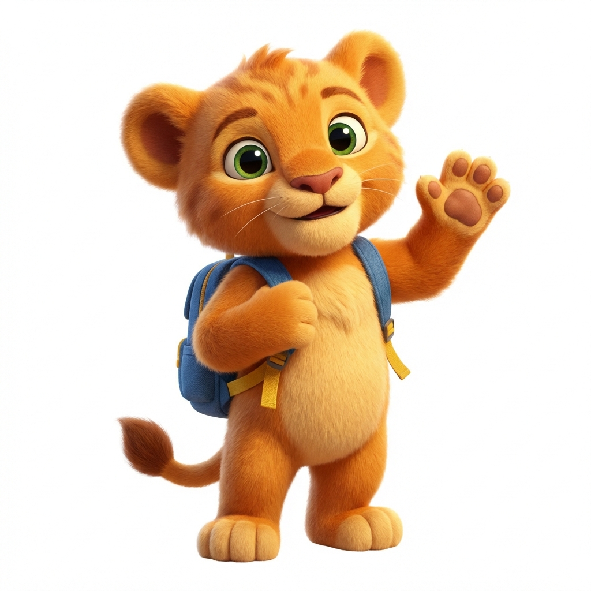
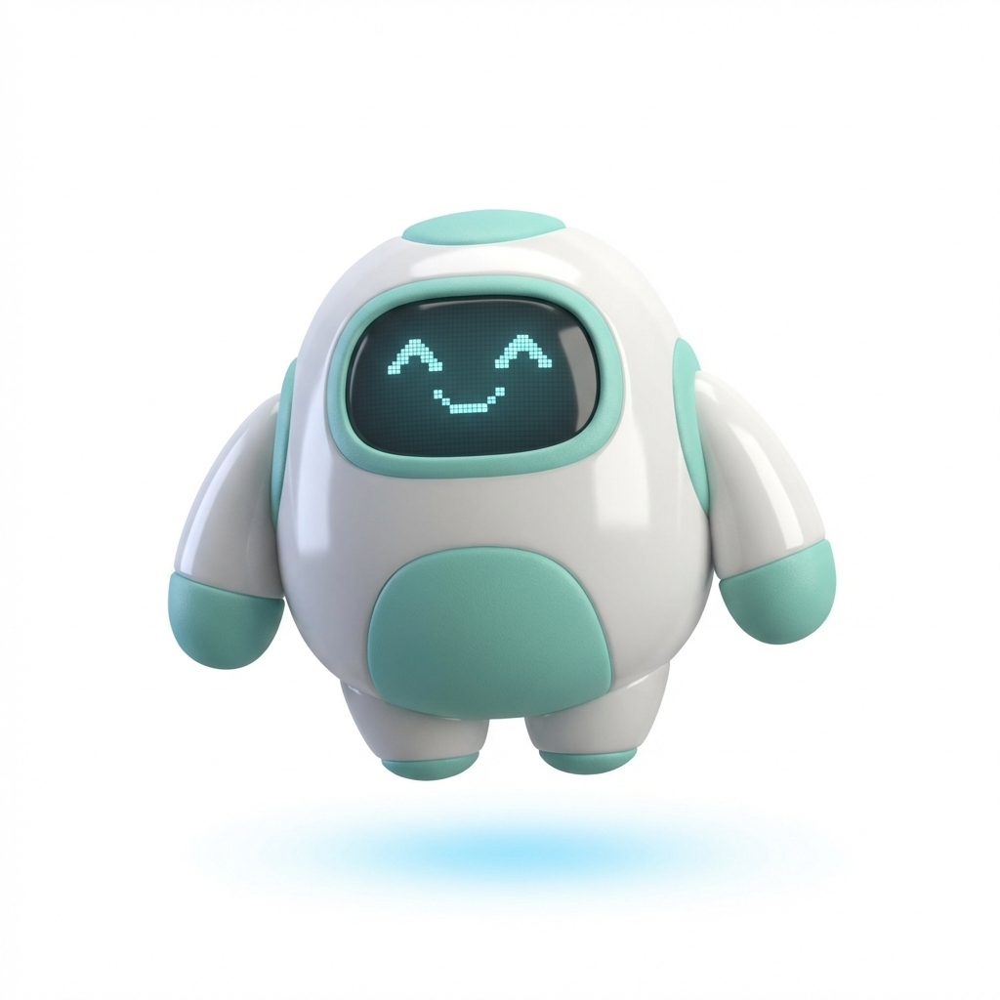
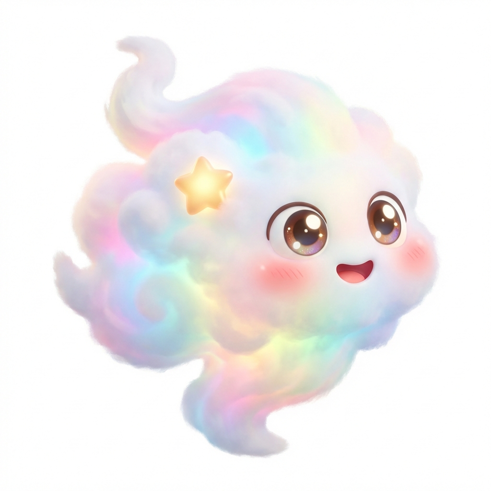

# Bright Kids: Mascot Design Concepts 🦁🤖☁️

A strong mascot is the heart of an early education app. It provides emotional support, guides the user, and makes learning feel like play. Based on our analysis of *Khan Academy Kids*, we have developed three distinct directions for the "Bright Kids" companion.

---

## Option 1: Leo the Lion Cub 🦁
**"The Brave & Warm Best Friend"**

### Personality Profile
- **Archetype**: The Courageous Learner.
- **Vibe**: Warm, fuzzy, enthusiastic, slightly clumsy but persistent.
- **Voice**: Cheerful young boy/girl (like Simba or Bluey).
- **Role**: He is learning *alongside* the child. He gets excited when *you* help him solve a puzzle.

### Analysis
| Feature | Rating | Notes |
| :--- | :--- | :--- |
| **Relatability** | ⭐⭐⭐⭐⭐ | Kids love animals. Fur texture feels "huggy". |
| **Animation Cost** | 🔴 High | Fur simulation and complex face rig required for high fidelity. |
| **Longevity** | 🟢 High | Classic appeal. Never goes out of style. |

**Verdict**: The safe, "Premium" choice. Matches the *Khan Kids* animal aesthetic directly.

---

## Option 2: Bop the Buddy Bot 🤖
**"The Helpful Tech Companion"**

### Personality Profile
- **Archetype**: The Gentle Guardian.
- **Vibe**: Smooth, floaty, magical tech. Think *Baymax* meets *Eve*.
- **Voice**: Soft, slightly processed melodic voice (beeps and boops for emotion).
- **Role**: A guide who opens portals to knowledge. He doesn't "learn", he "facilitates".

### Analysis
| Feature | Rating | Notes |
| :--- | :--- | :--- |
| **Relatability** | ⭐⭐⭐ | Less emotional than an animal, but very cool/modern. |
| **Animation Cost** | 🟢 Low | Rigid body parts + digital face = Easier to animate in Rive. |
| **Uniqueness** | ⭐⭐⭐⭐ | Sets us apart from the "Animal Zoo" apps. Fits "STEM" focus. |

**Verdict**: The smart, "Modern" choice. Easier to execute well on a budget.

---

## Option 3: Pip the Cloud Sprite ☁️
**"The Magical Dream Guide"**

### Personality Profile
- **Archetype**: The Whimsical Spirit.
- **Vibe**: Soft, shape-shifting, dreamy, calming.
- **Voice**: Giggly, airy, whispery.
- **Role**: A magical friend who floats through the "Sunny Valley" world naturally.

### Analysis
| Feature | Rating | Notes |
| :--- | :--- | :--- |
| **Relatability** | ⭐⭐⭐⭐ | Very cute and gender-neutral. |
| **Animation Cost** | 🟡 Med | Squishy/stretchy animation is fun but needs good physics. |
| **Thematic** | ⭐⭐⭐⭐⭐ | Fits perfectly with "Sunny Valley", "Sky", "Weather" themes. |

**Verdict**: The artistic, "Indie" choice. High charm factor.

---

## Recommendation 🏆

**We recommend Option 1: Leo the Lion Cub.**

**Why?**
1.  **Emotional Connection**: For ages 3-6, faces and fur create the strongest bond.
2.  **Market Expectations**: Parents trust "Storybook" aesthetics (like *Khan Kids* or *Hungry Caterpillar*).
3.  **Versatility**: A lion can roar (power), whisper (quiet time), and wear costumes (engagement).

*If budget/animation complexity is the primary constraint, **Option 2 (Bop)** is the strategic backup.*
